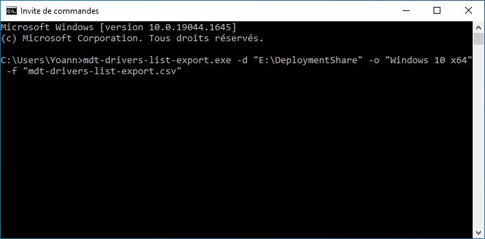

# MDT Drivers List Export

Windows command-line utility to export the drivers list in CSV format.

```
Usage : mdt-drivers-list-export.exe [-d <directory>] [-o <osname>] [-f <filename>]

-d, --deploymentshare : Deployment share (default: E:\DeploymentShare)
-f, --filename : Filename to export the drivers list in CSV format (default: %USERPROFILE%\mdt-drivers-list-export.csv)
-o, --os : Operating system name and version (default: Windows 10 x64)
-h, --help : Print this help screen
-v, --version : Print the version of the program and exit
```

This program have been created by Yoann LAMY under the terms of the [GNU General Public License v3](http://www.gnu.org/licenses/gpl.html).


